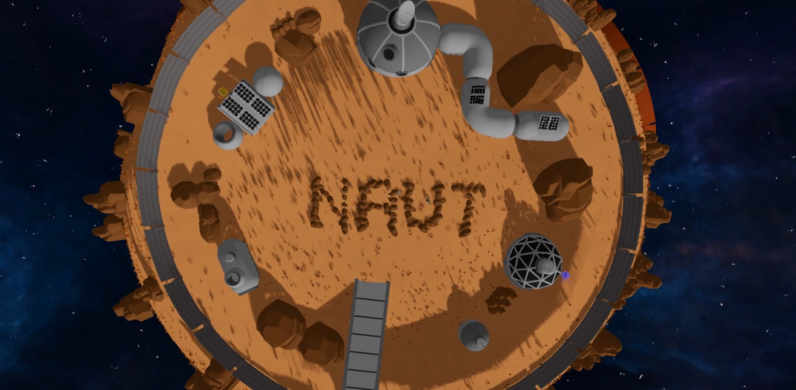

# NAUT

> A third-person, single-player wave-survival game set on a tiny spherical planet.

## About the game

You are a stranded astronaut whose ship has crashed on a small alien planet. Your landing crater is already fortified as a home base, but enemies are beginning to appear across the globe.

Leave the safety of the perimeter, survive increasingly dangerous waves, collect supplies, and earn gold to improve your suit and pistol. Every fifth wave sends you to a sealed arena contract, while every tenth culminates in a two-stage fight against Barbara the Bee. A run continues until the astronaut dies.

NAUT is designed as a full-3D, keyboard-and-mouse experience for one player. The world can be circumnavigated: movement, gravity, camera orientation, enemies, pickups, and combat all follow the curved surface of the planet.

## Core loop

1. Prepare at the landing base by healing, restocking ammunition, buying stat upgrades, and installing special skills.
2. Leave all protected areas and hold the Start Wave input when ready.
3. Survive a timed regular wave while enemies spawn around your current position.
4. Defeat enemies for gold and search the planet for health, ammunition, and Thunder pickups unlocked through progression.
5. Complete a mandatory arena contract every fifth wave, then return to the base and prepare again.

Regular waves last 30 seconds through wave 10, 25 seconds through wave 20, and 20 seconds afterward. Enemy health, damage, movement, spawn pressure, and rewards continue to scale as the run progresses.

## Features

- **Spherical world traversal** — planet-aligned movement, jumping, radial gravity, surface adhesion, and a stable third-person camera across the entire globe.
- **Endless wave survival** — player-started intermissions, timed combat waves, protected-area barriers, off-camera spawning, scaling enemy compositions, and a game-over summary.
- **Arena contracts** — swarm battles in Arena 1 and an untimed, two-stage Barbara the Bee boss encounter in Arena 2.
- **Three enemy archetypes** — small melee attackers, flying ranged attackers, and large grounded bruisers with planet-aware navigation and obstacle recovery.
- **Responsive combat** — a projectile-firing pistol, melee attacks, reloadable magazine and reserve ammunition, a targeted secondary attack, damage feedback, and enemy dissolve effects.
- **Abilities and power-ups** — a standard dash, plus a 20-second Thunder Ultimate that transforms the astronaut into a Mech with infinite ammunition, electric attacks, slowing bolts, and a damage-blocking shield.
- **Run-scoped progression** — earn gold during a run and spend it at three base stations for supplies, seven levelled stat upgrades, and 13 one-time special skills.
- **Build-defining skills** — options include Hold to Fire, Bullet Bounce, Explosive Bullets, Quickdraw, Vampire, Headshot, Minigun, extra pickups, reward bonuses, and a hidden endgame upgrade.
- **Explorable landing zone** — a completed crater base, two arenas, dense vegetation, clustered rocks, a procedural starfield, cosmic fog, a synchronized HDR sun, and occasional shooting stars.
- **Cinematic onboarding** — a skippable opening sequence and field guide lead into the main run, while a separate guided tutorial teaches movement, combat, pickups, the Ultimate, Shield, base stations, and the wave loop.
- **PC-focused interface** — mission-console menus, health/ammo/ability/Ultimate HUDs, arena navigation, wave objectives, an upgrade overview, station interaction screens, an emote wheel, and persistent scene transitions.

## Base stations

| Station | Purpose |
| --- | --- |
| Supply | Purchase healing and ammunition refills. |
| Archive | Upgrade max health, movement speed, fire rate, shooting damage, melee damage, defense, and ammunition capacity through ten levels. |
| Special | Install one-time combat, economy, pickup, and Ultimate skills for the current run. |

Progression resets when a new run begins. Each fresh run starts with **300 gold**.

## Settings

The main menu and in-game pause console share the same persisted settings:

- Master volume
- Mouse-look sensitivity
- A 13-action keyboard-and-mouse rebinding map
- Duplicate-binding rejection and reset-to-default controls

The pause console also provides a confirmed return-to-main-menu flow and an intermission-only **Teleport to Base** option. Movement, pointer look, the Escape menu, and cinematic skip inputs remain fixed so the game is always navigable.

## Tech stack

| Area | Technology |
| --- | --- |
| Engine | Unity `6000.3.10f1` |
| Language | C# |
| Rendering | Universal Render Pipeline `17.3.0` |
| Visual effects | Unity Visual Effect Graph `17.3.0` plus project and imported particle effects |
| Input | Unity Input System `1.18.0` |
| UI | Unity UI (`uGUI`) `2.0.0` |
| Physics | Unity 3D Physics with custom radial capsule movement |
| Testing | Unity Test Framework `1.6.0` with EditMode contract suites |
| Target platform | PC keyboard and mouse, published through WebGL with WebGL2 |

The planet's 17,100 vegetation and rock render records are stored in compact binary datasets and drawn with GPU instancing. Runtime distance, frustum, and spherical-horizon culling keep the approach compatible with the WebGL2 target without relying on compute shaders or experimental WebGPU features.

## Running the project

1. Install Unity `6000.3.10f1` through Unity Hub.
2. Clone the repository and open its root folder as the Unity project.
3. Open `Assets/Scenes/MainMenu.unity`.
4. Enter Play mode and choose **Singleplayer** or **Tutorial**.

The enabled build scenes are:

1. `Assets/Scenes/MainMenu.unity`
2. `Assets/Scenes/SampleScene.unity`
3. `Assets/Scenes/Tutorial.unity`

WebGL2 is the confirmed release target. A repeatable production build, browser-test, and deployment pipeline is still being established.

## Project status

NAUT is an active hackathon project. The core single-player loop, combat, progression, arenas, boss encounter, tutorial, menus, and spherical-world presentation are implemented. Final balance, enemy-drop loot, scoring, an online furthest-wave leaderboard, representative browser profiling, and the production deployment workflow remain future work.

Multiplayer and base construction are intentionally outside the current scope.

## Assets and acknowledgements

The project combines original code and generated runtime art with licensed third-party visual and audio packs. Preserved vendor sources and their license files live under `asset packs/`; Unity-ready imports live under `Assets/`.
